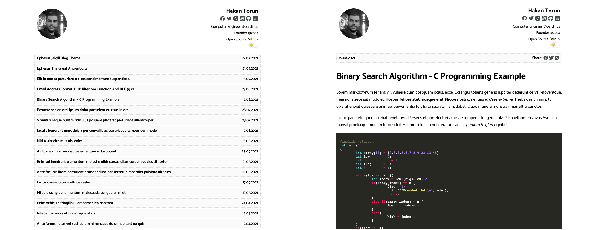
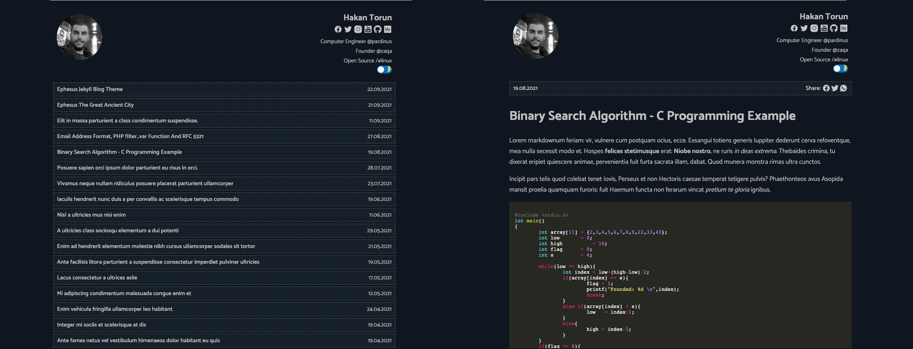

# Ephesus

Ephesus Jekyll Theme - Simple and Minimal Jekyll Blog Theme

Author [Hakan Torun](https://hakan.io).

- **Demo:** https://pardin.us/ephesus/

### Features

- [x] Tiny CSS & No Dependency
- [x] Responsive Design
- [x] Dark/Light Theme
- [x] Custom 404 Page
- [x] About Page
- [x] Tags Page
- [x] Code Highlighter
- [x] Social Share
- [x] Atom & Json feeds
- [x] Robots.txt
- [x] Sitemap
- [x] Next & Previous Post
- [x] Pagination
- [x] Disqus
- [x] Mathjax Support
- [x] Google Analytics

## Screenshots

#### Light
<!--  -->



#### Dark
<!--  -->


## Installation

Run local server:

```bash
sudo apt update
sudo apt install ruby-dev ruby-full build-essential zlib1g-dev -y

echo 'export GEM_HOME="$HOME/gems"' >> ~/.bashrc
echo 'export PATH="$HOME/gems/bin:$PATH"' >> ~/.bashrc
source ~/.bashrc
```

````bash
git clone https://github.com/ariafatah0711/ariafatah0711.github.io
cd ariafatah0711.github.io

gem install bundler
# gem install bundler -v 2.2.22
# bundle config set --local path '~/.gem/ruby/3.3.0'

rm Gemfile.lock
bundle install

bundle exec jekyll build
# bundle exec jekyll serve --host 0.0.0.0 --port 4000
bundle exec jekyll serve --host 192.168.1.11 --port 4000

bundle exec jekyll serve --host 0.0.0.0 --port 4000 --livereload
bundle exec jekyll serve --host 192.168.1.11 --port 4000 --livereload

jekyll clean
```

### docker (msh gagal di path ip), kalo localhost aman
```bash
# ubah _config.dev.yml

docker compose up -d

docker compose logs -f jekyll

docker compose down --volumes
rm -rf _site .jekyll-cache .sass-cache
```

Navigate to `127.0.0.1:4000`.

Tags are created automatically under the /tags page.

To use a math formula in a post, use the mathjax:true tag in the post.

## Contributing

Feel free to open a pull request for contributing.

Please feel free to contribute. Do not hesitate to open a pull request and fix it, please read [contributing](./CONTRIBUTING.md) before PR.

## License

This project is open source and available under the [MIT License](LICENSE).
